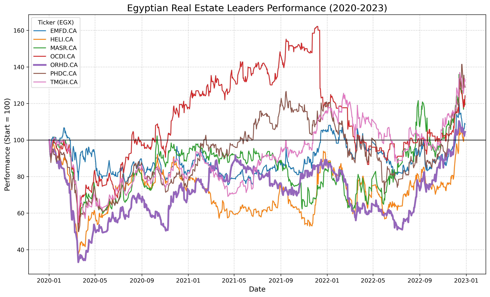

# 🏘️ Egyptian Real Estate Sector Analysis: COVID-19 Impact

## 📌 Project Overview
This project analyzes the performance of Egypt's top real estate developers during the COVID-19 pandemic and the subsequent recovery period. The goal is to measure risk, volatility, and recovery speed of major market players.

## 📂 Files in this Project
* **`real_estate_analysis.ipynb`**: The Jupyter Notebook containing the Python code, data fetching, and analysis logic.
* **`results.txt`**: A text summary of the calculated metrics (Sharpe Ratio, Annualized Volatility).
* **`real_estate_analysis_chart.png`**: The visualization generated by the code.
* **`requirement.txt`**: List of Python libraries needed to run the analysis.

## 📊 Key Results & Visualization
The chart below shows the rebased performance (Base=100) of TMGH, OCDI, HELI, and others. It highlights how different developers reacted to the systematic risk of 2020.



## 🛠️ How to Run
1.  Install dependencies:
    ```bash
    pip install -r requirement.txt
    ```
2.  Open the notebook:
    ```bash
    jupyter notebook real_estate_analysis.ipynb
    ```

---
**Author:** Fares Zeidan
