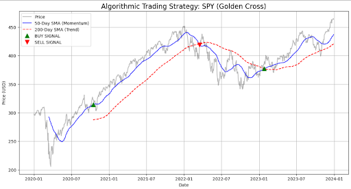

# Algorithmic Trading: Momentum Trend Following (SPY)

## 📌 Project Overview
This project implements a quantitative trading strategy based on the **Momentum Factor**.  
The strategy uses **Dual Moving Average Crossovers** to identify long-term market trends in the **S&P 500 ETF (SPY)**.

## 🧠 Strategy Logic
- **Fast Signal (MA50):** 50-day Simple Moving Average  
- **Slow Signal (MA200):** 200-day Simple Moving Average  

### Trading Rules
- 🟢 **BUY** → MA50 crosses above MA200 (*Golden Cross*)
- 🔴 **SELL** → MA50 crosses below MA200 (*Death Cross*)

> Signals are shifted to eliminate look-ahead bias.

## 📊 Performance Interpretation
- **2020–2021 (Post-COVID Bull Market):**  
  The strategy captured the major upward trend effectively.
- **2022 (Bear Market):**  
  A SELL signal protected the portfolio from deep drawdowns.
- **2023 Recovery:**  
  The strategy re-entered the market as momentum stabilized.

## 🛠 Tools & Libraries
- Python  
- Pandas  
- NumPy  
- Matplotlib  
- YFinance  

## 📂 Files
- `algorithmic_trend_following_spy.ipynb` – Full backtesting notebook  
- `spy_golden_cross_signals.png` – Strategy visualization  
