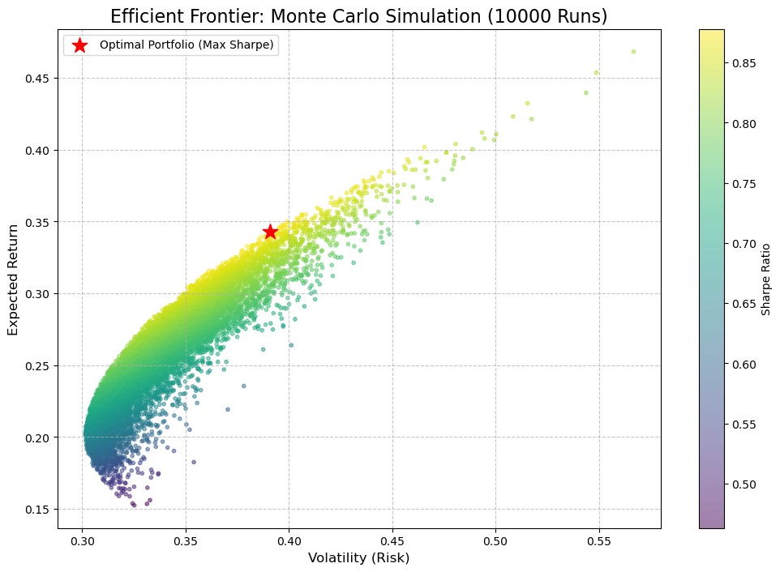

# Project 04: Markowitz Portfolio Optimization  
### Efficient Frontier Construction using Monte Carlo Simulation



---

## 📌 Project Motivation
In real-world investing, assets are **not evaluated in isolation**.  
The key challenge is not selecting the single best-performing stock, but rather
**constructing a portfolio** that achieves the highest possible return for a given
level of risk.

This project implements **Modern Portfolio Theory (MPT)**, originally proposed by
Harry Markowitz, to solve the asset allocation problem using quantitative methods.

---

## 🎯 Objective
The primary objective of this project is to:

- Construct thousands of possible portfolios using historical market data  
- Quantify **risk**, **return**, and **risk-adjusted performance**
- Identify the **optimal portfolio** that maximizes the **Sharpe Ratio**
- Visualize the **Efficient Frontier**, representing the trade-off between risk and return

---

## 🧠 Theoretical Background
Modern Portfolio Theory is built on the idea that portfolio risk depends not only on
the volatility of individual assets, but also on how those assets **co-move** with
each other.

Key theoretical components:
- **Log Returns** for time-additive statistical modeling  
- **Covariance Matrix** to capture asset interdependence  
- **Mean–Variance Optimization**  
- **Risk-adjusted performance (Sharpe Ratio)**  

The portfolio volatility is computed using the standard quadratic form:

\[
\sigma_p = \sqrt{w^\top \Sigma w}
\]

where:
- \( w \) is the vector of portfolio weights  
- \( \Sigma \) is the covariance matrix of asset returns  

---

## 🔬 Methodology

### 1. Data Collection
- Historical daily closing prices are downloaded using **Yahoo Finance**
- Assets analyzed:  
  **AAPL, MSFT, GOOGL, AMZN, TSLA**
- Time period: **2020 – 2024**

---

### 2. Return Modeling
- Daily **logarithmic returns** are computed:
\[
r_t = \ln\left(\frac{P_t}{P_{t-1}}\right)
\]
- Returns and covariance matrix are annualized using 252 trading days

---

### 3. Monte Carlo Portfolio Simulation
- **10,000 random portfolios** are generated
- Each portfolio uses randomly assigned weights constrained to sum to 1
- For every portfolio, the following metrics are calculated:
  - Expected annual return
  - Annualized volatility
  - Sharpe Ratio (risk-free rate assumed to be 0)

---

### 4. Optimization Criterion
- The portfolio with the **maximum Sharpe Ratio** is selected as the optimal portfolio
- This portfolio represents the best risk–return trade-off observed in the simulation

---

## 📊 Key Results
- Efficient Frontier visualization (risk vs. return)
- Identification of the **optimal portfolio**
- Asset allocation weights derived purely from statistical optimization
- Demonstration of diversification benefits through covariance reduction

---

## 🛠 Tools & Technologies
- **Python**
- NumPy
- Pandas
- Matplotlib
- yFinance

---

## 📂 Project Structure
```text
project_04_markowitz_portfolio_optimization/
├── README.md
├── efficient_frontier.png
└── markowitz_portfolio_optimization.ipynb
