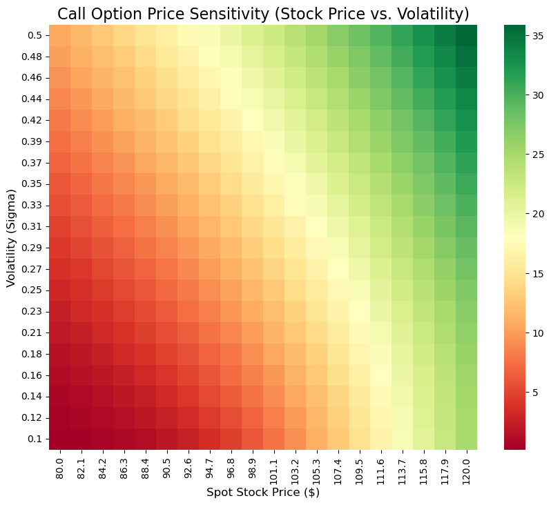

# Project 05 — Theoretical Option Pricing using Black-Scholes

## Overview
This project implements the **Black-Scholes option pricing model** to calculate the theoretical (fair) prices of European Call and Put options.  
The focus is on **model construction and sensitivity analysis**, not real-market trading.

This project serves as the **theoretical foundation** for applying option pricing to real stocks in later projects.

---

## Objectives
- Implement the Black-Scholes pricing formula from scratch
- Compute theoretical Call and Put option prices
- Analyze how option prices react to changes in stock price and volatility
- Visualize option price sensitivity using a heatmap

---

## Methodology
The Black-Scholes model prices options based on:
- Current stock price (S)
- Strike price (K)
- Time to maturity (T)
- Risk-free interest rate (r)
- Volatility (σ)

The model assumes:
- Log-normal price distribution
- Constant volatility
- No arbitrage
- European-style options

---

## Example Output
For the following inputs:
- Stock Price = $100
- Strike Price = $100
- Time to Maturity = 1 year
- Volatility = 20%
- Risk-Free Rate = 5%

The model produces:
- **Call Price:** $10.45
- **Put Price:** $5.57

These values represent the **theoretical fair prices** under Black-Scholes assumptions.

---

## Visualization
The heatmap below illustrates how Call option prices change as stock price and volatility vary.

**Key Insight:**  
Option prices increase as volatility and underlying price increase.

---

## Tools & Libraries
- Python
- NumPy
- SciPy
- Matplotlib
- Seaborn

---

## Notes
This project is **theoretical by design**.  
Live market data integration and applied pricing will be implemented in **Project 06**.

---

## Author
**Fares Awwad-Zeidan**
