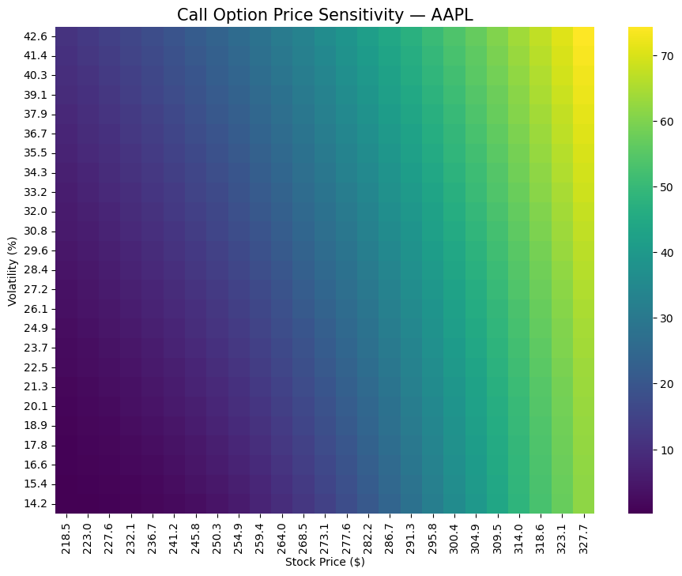

# Project 06 — Applied Option Pricing on Real Market Data

## Overview
This project applies the **Black–Scholes option pricing model** to **real market data**.
It retrieves live stock prices, estimates market volatility from historical returns,
and computes theoretical Call and Put option prices.

This project bridges **theoretical option pricing** and **real-world financial markets**.

---

## Objectives
- Fetch real stock prices automatically
- Estimate annualized volatility from historical data
- Price Call and Put options using Black–Scholes
- Visualize option price sensitivity using real market parameters

---

## Methodology
1. Retrieve historical stock prices using Yahoo Finance
2. Compute log returns and annualized volatility
3. Apply the Black–Scholes closed-form formula
4. Generate a sensitivity heatmap based on real data

---

## Visualization
The heatmap below shows how **Call option prices change** as:
- The underlying stock price varies
- Market volatility changes

This chart is **generated automatically by the code** each time it runs.

---

## Key Insight
Option prices increase as:
- Volatility increases
- The underlying stock price rises

This visualization demonstrates how uncertainty directly affects option value.

---

## Tools & Libraries
- Python
- NumPy
- Pandas
- SciPy
- Matplotlib
- Seaborn
- yFinance

---

## Notes
- This project uses **real market data**
- Prices update automatically on each execution
- Market prices may differ from theoretical values due to supply, demand, and liquidity

---

## Author
**Fares Awwad-Zeidan**
