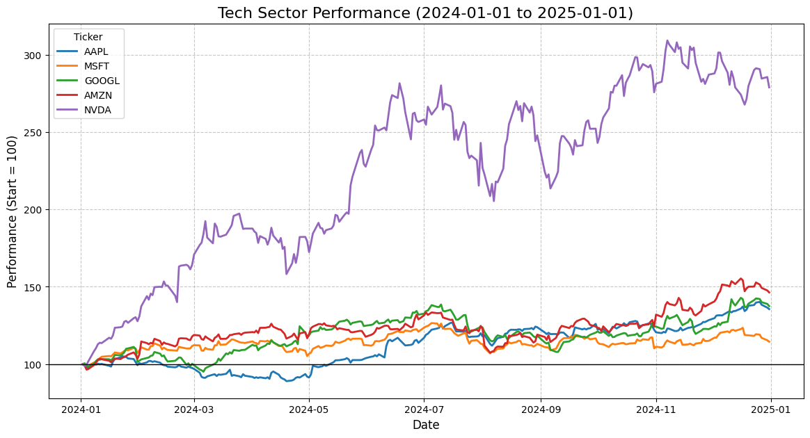

# 📈 Tech Stocks Risk & Return Analysis (2024-2025)

## 📌 Project Overview
This project performs a quantitative analysis of major US Tech stocks (**M7 & Competitors**) over the last fiscal year (Jan 2024 – Jan 2025). 

The goal was to evaluate **Risk-Adjusted Returns** using Python to determine which assets provided the best performance per unit of risk, with a specific focus on the AI sector boom.

## 📂 Files in this Project
* **`stock_analysis.py`**: The core Python script for data ingestion (yfinance), normalization, and metric calculation.
* **`results_chart.png`**: Visualization of the rebased performance.
* **`requirements.txt`**: List of dependencies.

## 📊 Quantitative Metrics (2024 Results)
The model calculated Annualized Volatility and Sharpe Ratios (assuming $R_f = 4.0\%$).

| Ticker | Annual Return | Annual Volatility | Sharpe Ratio |
| :--- | :--- | :--- | :--- |
| **NVDA** | **116.77%** 🚀 | 52.51% | **2.15** (Best Alpha) |
| **AMZN** | 42.19% | 28.11% | 1.36 |
| **AAPL** | 33.05% | 22.42% | 1.30 |
| **GOOGL** | 35.91% | 28.08% | 1.14 |
| **MSFT** | 15.60% | 19.95% | 0.58 |

### 💡 Key Insights:
* **NVIDIA (NVDA)** outperformed the sector significantly, driven by AI demand, but with the highest volatility (52%).
* **Microsoft (MSFT)** showed the lowest volatility but also the lowest risk-adjusted return (Sharpe < 1.0) for this period.

## 📉 Performance Visualization
The chart below displays Rebased Price Performance (Start = 100). Note the divergence of NVDA starting in Q2 2024.



## 🛠️ Methodology
1.  **Normalization:** Prices rebased to 100 ($P_t / P_0 \times 100$) to allow direct comparison.
2.  **Annualized Volatility:** $\sigma_{daily} \times \sqrt{252}$
3.  **Sharpe Ratio:** $\frac{R_p - R_f}{\sigma_p}$

## 🚀 How to Run
```bash
# 1. Install Dependencies
pip install -r requirements.txt

# 2. Run the Analysis
python stock_analysis.py
